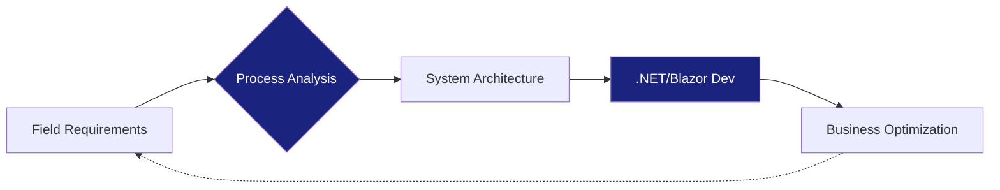

# 🚀 Hüseyin Emre
### **ERP Solution Consultant | Software Developer | System Architect**
*"Bridging the gap between complex business processes and elegant digital solutions."*

---

### 🏛️ The "Value Bridge"
As an **ERP Professional**, I specialize in transforming real-world field requirements into high-performance, user-centric software. I don't just write code; I design systems that optimize business flow.

> **Approach**: Analyze ➡️ Architect ➡️ Automate

---

### 🛠️ Core Technology Stack

| 💻 Development | 🗄️ Architecture & DB | ⚙️ ERP & Operations |
| :--- | :--- | :--- |
|  |  |  |
|  |  |  |
|  |  |  |

---

### 📊 Engineering Stats

---

### 💼 Career Snapshot

<b>🏢 Hisar Software | ERP Solution Consultant & Software Developer</b>

 
<i>June 2025 - Present</i>
- Leading full-cycle ERP implementations.
- Developing custom modules using .NET and Blazor.
- Bridging technical silos between field teams and development.

<b>🎓 Academic Background</b>

 
- **İskenderun Technical University**: Bachelor's in Management Information Systems
- **Osmaniye Korkut Ata University**: Associate Degree in Computer Programming

---

  

